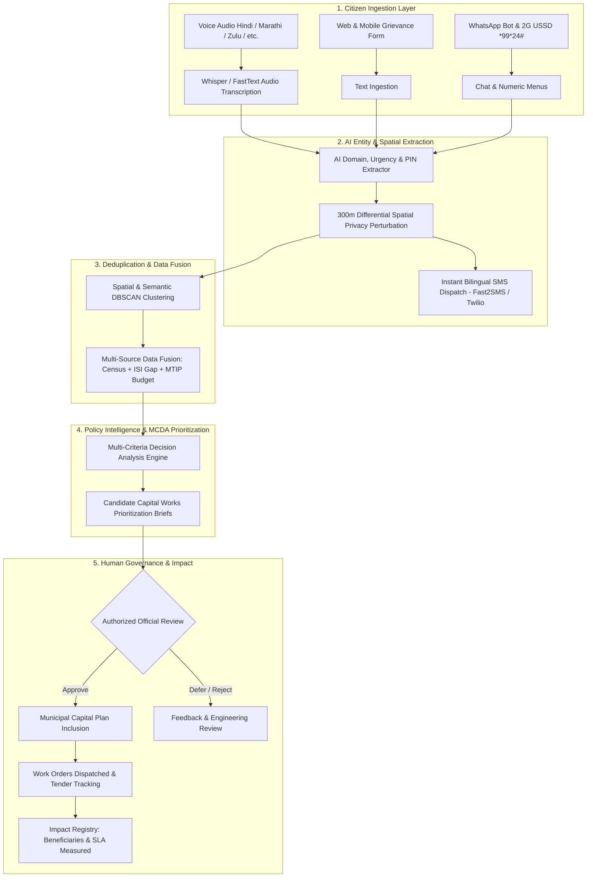
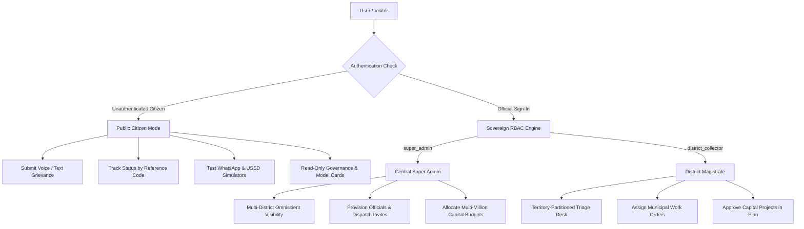

<div align="center">

# 🏛️ BRICS CivicPulse
### AI-Powered Digital Public Infrastructure (DPI) for Citizen Demand-Driven Governance & Capital Policy Intelligence

[](https://nextjs.org/)
[](https://www.typescriptlang.org/)
[](https://tailwindcss.com/)
[](https://digitalpublicgoods.net/)
[](LICENSE)
[](https://brics-civicpulse.vercel.app/)

*A sovereign, multilateral GovTech platform bridging the gap between grassroots multilingual citizen grievances and evidence-based municipal capital budget allocation.*

---

[🌐 Live Deployment](https://brics-civicpulse.vercel.app/) • [🚀 Quick Start](#-getting-started) • [✨ Key Modules](#-core-platform-modules) • [🎮 Interactive Simulators](#-interactive-prototype-simulators) • [🌐 Pilot Jurisdictions](#-live-pilot-jurisdictions) • [🛡️ RBAC & Governance](#-server-side-rbac--territory-isolation) • [📊 System Architecture](#-10-stage-dpi-pipeline-architecture)

</div>

---

## 📌 Executive Summary & Problem Statement

Across the BRICS+ economies, municipal infrastructure authorities face a critical disconnect:
1. **Unstructured & Multilingual Ingestion**: Millions of citizen demand signals across regional dialects (Hindi, Marathi, Zulu, Portuguese, etc.) remain trapped in isolated call centers, paper petitions, and messaging silos.
2. **Top-Down Budgeting Without Evidence**: Capital projects are frequently planned without ground-truth spatial validation, leading to under-served vulnerable populations and misallocated municipal spending.
3. **Data Sovereignty & Privacy**: Sovereign public sector institutions require transparent, explainable AI architectures with 100% data residency, offline fallback resilience, and strict role-based territory isolation.

**BRICS CivicPulse** solves this challenge by serving as an open, multilingual **Digital Public Infrastructure (DPI)** engine. It converts raw voice recordings, text, WhatsApp chats, and 2G USSD inputs into standardized geospatial demand clusters, matches them with multi-criteria vulnerability indices, and provides municipal authorities with quantifiable capital prioritization briefs.

---

## ✨ Core Platform Modules

### 1. 🎙️ Citizen Voice Studio & Live Ingestion (`/citizen`, `/`)
- **Multilingual Voice-to-Text Pipeline**: Instant transcription and translation across Hindi, Marathi, Zulu, Portuguese, Russian, Chinese, and English.
- **Automated Entity Extraction & Pincode Geocoding**: High-precision AI classification of infrastructure domain (Water, Roads, Energy, Health), specific deficit, and location coordinates.
- **300m Spatial Privacy Buffer**: Automatic noise perturbation ensuring citizen physical privacy while preserving municipal spatial aggregation.
- **Instant Bilingual SMS Dispatch (Fast2SMS & Twilio)**: Dispatches official SMS receipts with tracking reference codes in both Hindi and English upon submission.
- **Instant Status Stepper on Homepage**: 4-stage live progress timeline (`Submitted` → `AI Geocoded` → `Nodal Triage` → `Dispatched`) directly on the homepage.

### 2. 📱 Low-Connectivity & Offline DPI Ingestion (`/citizen`, `/`)
- **WhatsApp AI Conversational Bot**: Interactive conversational assistant parsing vernacular grievances and returning immediate GIS tracking links.
- **2G USSD (*99*24#) Offline Protocol**: Zero-data dialer enabling citizens with basic feature phones to file infrastructure grievances via numeric menus.

### 3. ⚡ Operations Triage & Deduplication Desk (`/operations`)
- **Semantic Similarity Clustering**: Deduplicates overlapping citizen complaints into unified infrastructure demand clusters.
- **Confidence Scoring & Anomaly Detection**: Highlights extraction confidence with full transparency on uncertain fields.
- **Human-in-the-Loop Authority Verification**: Authorized district nodal officers review AI taxonomy, assign accountable engineering departments, and dispatch work orders.
- **Territory-Scoped Scoping**: District Collectors access only complaints originating within their designated municipal territory (e.g., Jehanabad DM sees only Jehanabad complaints).

### 4. ⚖️ Policy Intelligence & Multi-Criteria Prioritization Engine (`/planning`)
- **Multi-Criteria Decision Analysis (MCDA)**: Mathematical weighting combining:
  - *Citizen Demand Density* (Aggregated verified complaint count)
  - *Demographic Vulnerability Index* (Marginalized population coverage)
  - *Infrastructure Gap Deficit* (Service index lag)
  - *Fiscal Cost Efficiency* (Cost per citizen beneficiary served)
  - *SDG & Climate Resilience Priority*
- **Real-Time AI Policy Lens Simulator**: Live MCDA slider engine with 4 instant policy presets (*Water & Health 1st*, *Climate Resilience*, *Rural Economic Corridors*, *Vulnerability Equity*) that dynamically recalculates project rankings, cost efficiency, and beneficiary population impact in real time.
- **Traceable Evidence Drawer**: Verbatim citizen demand samples linked directly to recommended capital projects.
- **1-Click Executive Decision Brief**: Generates publication-ready Markdown/CSV policy briefs for municipal legislative councils.

### 5. 🧬 DPG Open Data & Interoperability Console (`/data`)
- **Standardized REST Endpoints**: Test `/api/clusters`, `/api/submissions`, `/api/recommendations`, and `/api/export`.
- **Open Formats**: 1-click downloads in GeoJSON, CSV, and JSON-LD with 300m differential privacy.

### 6. 🏆 Infrastructure Impact & Delivery Registry (`/impact`)
- **End-to-End Lifecycle Tracking**: Auditable chain from initial citizen voice recording to completed contractor delivery.
- **Measurable Public Value**: Tracks citizen beneficiaries served, average SLA resolution time, and public trust scores.
- **Interactive Before / After Verification**: Photographic inspection records for verified public works.

### 7. 🛡️ Sovereign Governance & Model Ethics Hub (`/governance`)
- **AI Model Cards (§10 PRD)**: Formal documentation of training datasets, hallucination limits, and ethical bias benchmarks.
- **Multi-Provider AI Switchboard**: Real-time dynamic routing and automatic fallback:
  - `Groq LPU` (Ultra-low latency Llama 3.3, ~85ms)
  - `Google Gemini 1.5 Flash` (Multimodal and deep contextual analysis, ~210ms)
  - `Local NLP Engine` (Zero-latency offline edge resilience, ~12ms)
- **Go/No-Go Readiness Gates (§15 PRD)**: Automated system audits validating latency, safety filters, and cryptographic hash integrity.

---

## 🎮 Interactive Prototype Simulators

CivicPulse includes interactive simulators embedded directly into the live application for evaluator walkthroughs:

| Simulator | Location | Features |
| :--- | :--- | :--- |
| **📱 WhatsApp & 2G USSD Bot** | `/` (Homepage) & `/citizen` | Bilingual conversational assistant + offline feature phone `*99*24#` simulator in Hindi, English, Portuguese & Zulu. |
| **⚖️ AI Policy Lens & MCDA Engine** | `/` (Homepage) & `/planning` | 6-factor weight slider engine, 4 policy presets, dynamic ROI recalculation & decision brief export. |
| **🔍 Instant Grievance Stepper** | `/` (Homepage) & `/citizen` | 4-stage live tracker with quick sample buttons (`CP-IN-2026-8041`, `CP-IN-2026-8044`). |
| **🧬 DPG Open API Playground** | `/data` | Live query runner for `/api/clusters`, `/api/submissions`, and 1-click GeoJSON/CSV exports. |

---

## 🌐 Live Pilot Jurisdictions

| Territory | Flag | Assigned Authority | Primary Focus Domain | Capital Budget |
| :--- | :---: | :--- | :--- | :--- |
| **Jehanabad (Bihar)** | 🇮🇳 | **Shri Alok Ranjan (IAS)** | Potable Water Pipeline & Open Storm Drainage | `$1,800,000 USD` |
| **Dhule (Maharashtra)** | 🇮🇳 | **Dr. Vivek Deshmukh (IAS)** | Culvert Bridge Subsidence & Rural Power Grid | `$2,200,000 USD` |
| **City of Tshwane (Gauteng)** | 🇿🇦 | **Dr. Thabo Mokoena** | Municipal Water Pressure & Township Clinics | `$3,500,000 USD` |
| **Recife Metropolitan** | 🇧🇷 | **Dr. Maria Santos** | Coastal Flood Mitigation & Canalization | `$4,100,000 USD` |
| **Central National Oversight** | 🏛️ | **Gautam Kumar (IAS)** | Omniscient All-Territory Multi-District Scope | `$50,000,000 USD` |

---

## 📊 10-Stage DPI Pipeline Architecture



---

## 🔒 Server-Side RBAC & Security Architecture



### Key Security Safeguards:
- **Zero Citizen Privilege Escalation**: Triage modification, status updates, official provisioning, and project approval buttons are completely hidden and blocked for citizens.
- **Invitation-Driven Onboarding**: Public self-registration for official accounts is disabled. Super Admin provisions officials and dispatches cryptographic activation tokens.
- **Sanitized Login**: No hardcoded or evaluator credentials exposed in client bundles.

---

## 🛠️ Technology Stack

- **Frontend Core**: Next.js 14 (App Router), React 18, TypeScript
- **Styling & Aesthetics**: TailwindCSS, Vanilla CSS Design System, Lucide Icons, Glassmorphic HUDs, Warm Brown & Orange Sovereign Theme
- **AI Switchboard**: Google Gemini 1.5 Flash, Groq LPU (Llama 3.3), Local NLP Edge Switchboard
- **SMS & Alerts Gateway**: Fast2SMS (India Gateway) + Twilio REST API + Simulated High-Fidelity Receipts
- **Database & Storage**: In-Memory Sovereign Store + Neon Serverless PostgreSQL
- **Standards**: Digital Public Goods (DPG) Open APIs, 300m Differential Privacy

---

## 🚀 Getting Started

### 1. Clone the Repository
```bash
git clone https://github.com/Gautam-kumar01/BRICS.git
cd BRICS
```

### 2. Install Dependencies
```bash
npm install
```

### 3. Configure Environment Variables
Create a `.env.local` file in the root directory:
```env
# Fast2SMS Cellular Gateway (For live SMS dispatch to Indian numbers)
FAST2SMS_API_KEY=your_fast2sms_api_key_here

# AI Switchboard Providers (Optional - Local NLP works automatically without keys)
GEMINI_API_KEY=your_gemini_api_key_here
GROQ_API_KEY=your_groq_api_key_here

# Twilio SMS (Optional fallback)
TWILIO_ACCOUNT_SID=your_twilio_sid
TWILIO_AUTH_TOKEN=your_twilio_token
TWILIO_PHONE_NUMBER=your_twilio_phone

# PostgreSQL Database (Optional - In-memory store active by default)
DATABASE_URL=your_neon_postgres_url_here
```

### 4. Run Development Server
```bash
npm run dev
```
Open [http://localhost:3000](http://localhost:3000) in your browser.

---

## 👥 Authors & Governance

Developed for **Hack2Skills — AI for Digital Public Infrastructure (DPI) & Governance (Track 1)**.

**Lead Architect & Governance Admin:** Gautam Kumar (`gautamkr192007@gmail.com`)
